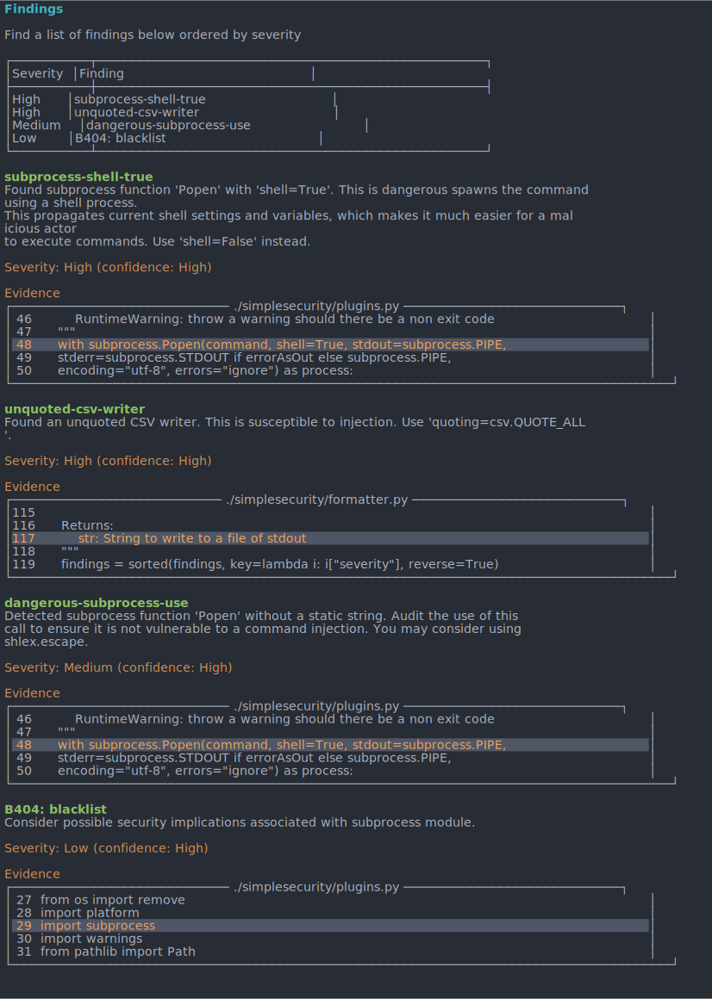

Getting Started
===============

Install With PIP
----------------
A requirement for using SimpleSecurity is having a version of python 3.x installed.

.. highlight:: bash
.. code-block:: bash

   pip install simplesecurity

Head to https://pypi.org/project/SimpleSecurity/ for more info
This program has been written for Python versions 3.7 - 3.10 and has been tested with both 3.7 and
3.10

Run CLI
---------
In order to run the CLI utility, you can run `simplesecurity` in this directory

Options in the CLI tool include:

.. highlight:: bash
.. code-block:: bash

   usage: __main__.py [-h] [--format FORMAT] [--plugin PLUGIN] [--file FILE]
                      [--level LEVEL] [--confidence CONFIDENCE]
                      [--no-colour] [--high-contrast] [--fast] [--zero]

   Combine multiple popular python security tools...

   and generate reports or output into different formats.

   optional arguments:
     -h, --help            show this help message and exit
     --format FORMAT, -f FORMAT
                           Output format. One of ansi, json, markdown, csv. default=ansi
     --plugin PLUGIN, -p PLUGIN
                           Plugin to use. One of bandit, safety, dodgy, dlint, semgrep, all, default=all
     --file FILE, -o FILE  Filename to write to (omit for stdout)
     --level LEVEL, -l LEVEL
                           Minimum level/ severity to show
     --confidence CONFIDENCE, -c CONFIDENCE
                           Minimum confidence to show
     --no-colour, -z       No ANSI colours
     --high-contrast, -Z   High contrast colours
     --fast, --skip        Skip long running jobs. Will omit plugins with long run time (applies to -p all only)
     --zero, -0            Return non zero exit code if any security vulnerabilities are found

You can also import this into your own project and use any of the functions
in the DOCS

Configuring Semgrep
-------------------
The configuration of SemGrep is organized with a `yaml` file. A default config is already enclosed in this library. I
you want to specify the config, you can follow the steps below:

1. Clone https://github.com/returntocorp/semgrep-rules
2. cd to `semgrep-rules/python`
3. do

.. highlight:: bash
.. code-block:: bash

   cat **/security/**/*.yaml >> semgrep_sec.yaml
   cat **/security/*.yaml >> semgrep_sec.yaml

4. Find and replace `rules:` with `` apart from the first instance
5. Reformat with `ctrl+shift+i`
6. replace simplesecurity/semgrep_sec.yaml with the new one